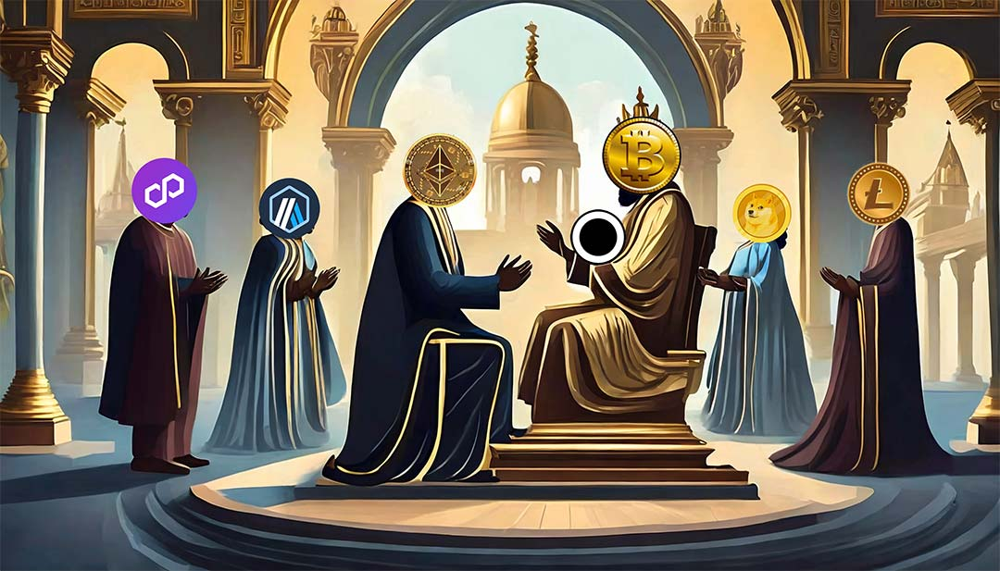

# qrpaper 

[OKX](https://www.okx.com/web3/marketplace/nft/collection/btc/qrpaper-bitcoin)
|
[MagicEden](https://magiceden.io/ordinals/marketplace/qrpaper-bitcoin)
|
[UniSat](https://unisat.io/market/collection?collectionId=qrpaper-bitcoin)
|
[Medium](https://bitsoul.medium.com)
|
[Telegram](https://t.me/bitsoul_xyz)
|
[Discord](https://discord.gg/3MjNRBhuRv)
|
[Twitter](https://twitter.com/bitsoul_xyz)

## Slogan
**Salute to Satoshi, qrpaper makes Bitcoin great forever !!!**

## Introduction
qrpaper is a **Bitcoin-native NFT**, distinct from other PFP projects 
that are copied from Ethereum. And it helps crypto projects inscribe 
whitepaper on Bitcoin with **WhitePaper Sharding Technology**.

It converts the whitepaper into plain text format of markdown, and after splitting
it into sentences, encodes each sentence into a QR code, signs it, and inscribes 
it on Bitcoin with Ordinals Protocol for permanent storage.

## Significance
As the earliest blockchain, Bitcoin's value mainly comes from consensus, 
but it is also constantly facing challenges from other public chains. 

In order to consolidate the value of Bitcoin, we put forward the slogan 
**"Salute to Satoshi, every project should inscribe WhitePaper on Bitcoin"**. 

Which is not only conducive to continuously strengthening the consensus of Bitcoin, 
but also It is beneficial for new projects to be understood and accepted by Bitcoin users.

## Why bitcoin
1. Bitcoin is the first blockchain, it is the chain with the highest degree of consensus and the highest security
2. Bitcoin ordinals protocol, storing all of the NFT data on the chain, it would not be lost forever
3. Bitcoin has the largest TVL, inscribing your project whitepaper on Bitcoin is very memorable and advantageous 

## Why qrpaper
1. qrpaper is the first project that helps users inscribe their whitepaper on Bitcoin using ordinals protocol
2. qrpaper optimized the NFT image generation technology, compressed the data size to the limit, it greatly reduced the gas
3. qrpaper use qrpaper.sats domain to sign every NFT to ensure no one can fake it
4. qrpaper split and visualized the whitepaper to qrcode, which has a beautiful style, it is easy to spread
5. qrpaper is governed by the community through qp-dao, it's a decentralized project

## Pay attention
1. every qrpaper is signed by **qrpaper.sats**, and **qp** logo is embedded
2. the address of it is: **12duB7eUwCCqum5rezYJGRy2UDhb4EkeoN**
3. the taproot address is: **bc1p3lpgz3246uqc87zp8ex7s7q6xka0z9g0djv9n0e2a3gqqlcetl4stwgrqd**

## Example
This is an example qrpaper, which includes the first fragment of the Bitcoin WhitePaper. 
The size of it is only about 1KB, it's very cheap to inscribe on the Bitcoin chain.

The image contains four parts mainly:
1. the qrcode information in the whole image
2. the bitcoin logo in the middle
3. the qrpaper logo in the bottom right corner
4. the serial number on the foot

